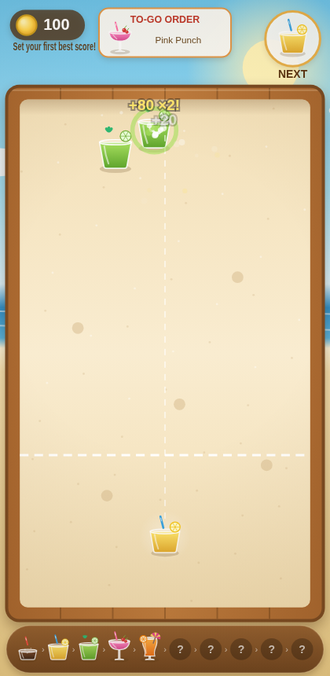
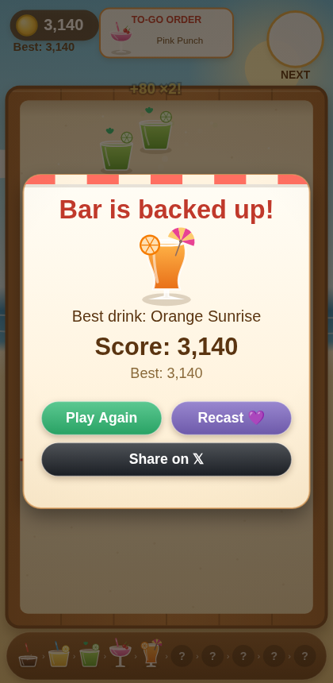

# Merge Sip 🍹

**Play now → [mergesip.xyz](https://mergesip.xyz)** · live as a **Base Mini App** · contract on **[Base mainnet](https://basescan.org/address/0x34d43D6570664919a17071C17acb3A7e48A0A762)**

A beach-bar **shuffleboard merge game**. Flick tropical drinks up the sandy
board — when two identical drinks collide they merge into the next, fancier
cocktail. Chase the 10-tier chain all the way to the **Legendary Tiki**, serve
to-go orders for bonus coins, and don't let the bar back up past the dashed
line!

| Gameplay | Game over |
| --- | --- |
|  |  |

## Where to play

- **Base App** — share or open [mergesip.xyz](https://mergesip.xyz) inside
  Base App and it launches as a mini app (in-app wallet, haptics, cast
  sharing). Verified manifest, indexed in the mini-app catalog.
- **Any browser** — [mergesip.xyz](https://mergesip.xyz) works on desktop and
  mobile with an injected wallet (MetaMask) or Base Account.
- **Onchain** — usernames, scores, badges, and score-card NFTs live in the
  [`DrinkTally`](contracts/src/DrinkTally.sol) contract at
  [`0x34d4…A762`](https://basescan.org/address/0x34d43D6570664919a17071C17acb3A7e48A0A762)
  on Base mainnet.

## Getting started (2 minutes)

1. **Open [mergesip.xyz](https://mergesip.xyz)** (in Base App or a browser).
2. **Connect your wallet** — Base App's in-app wallet connects with one tap;
   in a browser you can use MetaMask or Base Account. If your address has a
   **Basename**, the game shows it instead of `0x…`.
3. **Register your username** — pick a 3-16 character handle (a-z, 0-9, _).
   Hitting **Register** mints it onchain via `claimUsername` (you pay a tiny
   bit of Base gas). Usernames are globally unique and appear on the
   leaderboard, your score cards, and your shares. Returning players skip
   straight past this — the game recognizes your claimed name.
4. **Start Mixing** — or take on today's **Daily Mix**.

## How to play

**Controls:** touch (or click) and drag left/right to aim, release to send the
drink sliding up the board. Drinks glide on sand friction and bounce off the
walls and each other.

**Merging:** two matching drinks that touch merge into the next tier and score
points. The full chain:

| Tier | Drink | Merge points |
|-----:|-------|-------------:|
| 1 | Cola Pop | — (starter) |
| 2 | Lemon Fizz | 20 |
| 3 | Lime Cooler | 40 |
| 4 | Pink Punch | 80 |
| 5 | Orange Sunrise | 150 |
| 6 | Blueberry Breeze | 250 |
| 7 | Mojito Royale | 400 |
| 8 | Berry Colada | 650 |
| 9 | Sunset Slush | 1,000 |
| 10 | **Legendary Tiki** | **2,000** |

**Game over:** if any drink comes to rest **below the dashed line**, the bar
is backed up and the shift ends. The line pulses red when the pile gets close.

### Mechanics to master

- **Combos ×5** — merges chained within ~2 seconds multiply their points, up
  to ×5. Set up multi-merge shots for huge scores.
- **Wildcard shaker 🍸** — a rare silver shaker (unlocks after your first
  Pink Punch) that merges with *any* drink below the Tiki. Save it for your
  biggest glass.
- **To-Go Orders** — deliver the drink shown on the order card for a 2×
  points bonus, and the barback clears the three smallest drinks off the
  board — your pressure-release valve.
- **The dealer gets meaner** — as you mix higher tiers, bigger drinks start
  appearing in your hand and crowd the board.

### Daily & social

- **🌞 Daily Mix** — one seeded challenge per day: every player worldwide
  gets the *same* drink sequence. Your daily best is tracked separately.
- **🔥 Streaks** — play at least once a day and your streak grows (shown on
  the intro screen).
- **🎯 Challenge links** — every shared score embeds a challenge. Friends who
  open your link see "beat @you: 1,234" as a live target in their game, and
  the game-over screen declares the winner.
- **Sharing** — *Recast* opens the cast composer inside Base App; *Share on 𝕏*
  renders your score card as a PNG client-side and opens the native share
  sheet (or downloads it + a prefilled tweet on desktop).

### Onchain rewards

- **Auto-saved bests** — beat your onchain best and the game starts the
  `serveScore` transaction automatically (your wallet still asks you to sign).
- **Milestone badges** — the first time you ever mix each tier-6+ drink you
  earn a badge, stored onchain as a bitmask and shown on the intro screen.
- **Score-card NFTs** — mint your best run as an ERC-721 (`SIPCARD`) whose
  artwork is an SVG generated *entirely by the contract* — no IPFS, no
  servers.
- **Leaderboards** — the all-time top 10 is maintained onchain; a **This
  Week** tab is rebuilt client-side from `ScoreServed` events.

## Under the hood

### The DrinkTally contract

[`contracts/src/DrinkTally.sol`](contracts/src/DrinkTally.sol) — one contract
(ERC-721 + game logic), deployed at
[`0x34d43D6570664919a17071C17acb3A7e48A0A762`](https://basescan.org/address/0x34d43D6570664919a17071C17acb3A7e48A0A762):

- `claimUsername(name)` — globally unique handles (3-16 chars a-z/0-9/_),
  validated onchain; changing your name frees the old one.
- `serveScore(score, tier)` — records a run: bumps the global `totalServed`,
  updates your `bestScore`/`bestTier`, awards milestone badges, and re-ranks
  the onchain top-10 board.
- `mintScoreCard()` — snapshots your best as a fully-onchain SVG NFT.
- `getLeaderboard()` — players, scores, tiers, and names in one read.

Players pay their own gas — there is deliberately no sponsorship. Every
transaction the game sends carries an
[ERC-8021 builder code](https://docs.base.org) suffix for onchain attribution.
Contract dependencies: `@openzeppelin/contracts@4.9`, compiled for the `paris`
EVM so local ganache testing works.

### The client

- [Vite](https://vite.dev) + TypeScript, zero-framework; Canvas 2D rendering
  with a small custom physics engine (circle collisions, sand friction, flick
  input).
- All in-game art is drawn procedurally at runtime (`src/drinks.ts`); sound is
  a WebAudio synth (`src/sfx.ts`). No image or audio assets in the game loop.
- [`@farcaster/miniapp-sdk`](https://miniapps.farcaster.xyz) for Base App
  integration (`sdk.actions.ready()`, `composeCast`, haptics) with graceful
  fallbacks for plain browsers.
- `@wagmi/core` + `viem` for the onchain layer, lazy-loaded (`src/onchain.ts`
  facade) so the game paints instantly. Wallet support: Base App in-app
  wallet, Base Account, injected (MetaMask), with auto-reconnect and
  **Basename** reverse resolution for connected addresses.
- **EIP-5792** capability detection: smart wallets submit batched `sendCalls`,
  EOAs fall back to plain transactions — with explicit
  connect → switch-chain → sign → confirm states surfaced in the UI.

## Develop

```bash
npm install
npm run dev     # http://localhost:5173
npm run build   # outputs dist/
```

### Networks: mainnet for players, testnet for testing

Network selection lives in `src/config/tally.ts` (first match wins):

1. `localStorage.setItem('merge-sip-network', 'base-sepolia')` — flip a
   running build to testnet from the browser console (no rebuild)
2. `VITE_TALLY_NETWORK=base-sepolia npm run build` — a staging build
3. default: `base` (mainnet)

The onchain UI hides entirely on any network whose address in the `ADDRESSES`
map is the zero address — the game then runs fully offchain with a locally
stored username (handy for development).

Quick overrides, no rebuild:
`localStorage.setItem('merge-sip-tally-address', '0x...')` and
`localStorage.setItem('merge-sip-rpc-url', 'http://127.0.0.1:8545')`.

### Deploying the contract

**Option A — Foundry** (the [Deploy on Base](https://docs.base.org/get-started/deploy-on-base) flow):

```bash
cd contracts
curl -L https://foundry.paradigm.xyz | bash && foundryup   # install Foundry once
cp .env.example .env && source .env
cast wallet import deployer --interactive                  # never commit keys

# dry run first, then add --broadcast to actually deploy:
forge create ./src/DrinkTally.sol:DrinkTally \
  --rpc-url $BASE_SEPOLIA_RPC_URL --account deployer --broadcast

# verify:
cast call <CONTRACT_ADDRESS> "totalServed()(uint256)" --rpc-url $BASE_SEPOLIA_RPC_URL
```

**Option B — Node only** (no Foundry; solc + viem):

```bash
npm i -D solc
node scripts/compile-contract.mjs
PRIVATE_KEY=0x... node scripts/deploy.mjs --network base-sepolia   # testnet
PRIVATE_KEY=0x... node scripts/deploy.mjs --network base           # mainnet
```

Paste the **deployed contract address** (not your wallet address!) into the
`ADDRESSES` map in `src/config/tally.ts` and rebuild.

### Local end-to-end loop (no testnet ETH needed)

```bash
npm i -D solc ganache playwright
npx ganache --chain.chainId 84532 --wallet.deterministic   # terminal 1
node scripts/compile-contract.mjs                          # terminal 2
PRIVATE_KEY=<a ganache key> node scripts/deploy.mjs --network local
npm run dev                                                # terminal 3
node scripts/e2e-local-chain.mjs <deployed-address>        # full flow test
```

The E2E drives the real UI against the local chain: connect → onchain
username claim → play → auto-serve → mint → leaderboard. Two more regression
scripts cover badge-driven auto-saves (`e2e-milestone-save.mjs`,
`e2e-badges-loading.mjs`).

### Repo tooling

- `scripts/gen-assets.mjs` + `assetgen.html` — regenerate `public/icon.png`,
  `public/splash.png`, `public/hero.png` from the in-game art in headless
  Chromium.
- `scripts/smoke-test.mjs` — headless gameplay smoke test (launch, merge,
  game over, restart).
- `scripts/onchain-test.mjs` — headless onchain-flow test with a mock
  EIP-1193 provider.

## Deploy your own instance

Fork-friendly. The short version:

1. **Static hosting** (Vercel/Netlify/Cloudflare Pages): build `npm run build`,
   output `dist`, then point your domain's DNS at the host.
2. **Swap the URLs** — replace `https://mergesip.xyz` with your domain in
   `public/.well-known/farcaster.json`, `index.html` (the `fc:miniapp` /
   `fc:frame` metas), and `src/base.ts` (`APP_URL`).
3. **Verify domain ownership** — sign the `accountAssociation` for your domain
   with the [Farcaster manifest tool](https://farcaster.xyz/~/developers/mini-apps/manifest)
   (or [base.dev](https://base.dev)) and paste the `header`/`payload`/`signature`
   into `public/.well-known/farcaster.json`.
4. **Register on [base.dev](https://base.dev)** — add the `base:app_id` meta
   tag it gives you to `index.html`, put your builder address in
   `baseBuilder.allowedAddresses`, and (optionally) swap in your own
   ERC-8021 builder-code suffix in `src/wallet.ts`.
5. **Share your URL in Base App** — the embed meta renders it as a launch
   card, and the verified manifest makes it indexable.
